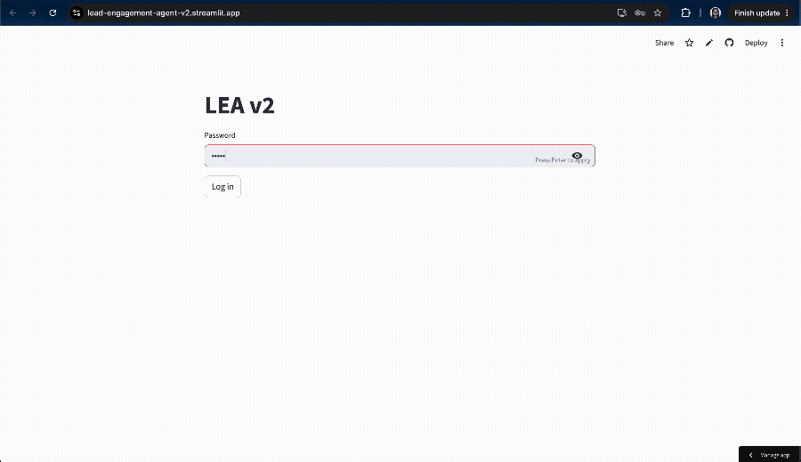

# LEAv2 — Lead Engagement Agent

Takes one qualified sales lead and turns it into a b2b contact-ready outreach package: a structured Engagement Plan (best contact route, recommended CTA, objections to prepare for) plus two ready-to-send outreach messages, in Japanese and English.

Built for Language instruction company (that has mercari, line, NEC as its clients) as part of an internal, multi-agent sales tooling project. 

**Live demo:** https://lead-engagement-agent-v2.streamlit.app


## What it does

Give it a company, whatever you already know about a contact there, and any personalization angles you have — a warm introduction, a known mutual connection, a buying signal you noticed, something relevant about their role or industry. LEAv2 fills in the rest:

- Checks a private CSV of known connections within the company and past competitor client lists for any existing angle in
- Runs a Claude-powered research agent (with live web search) to find what's publicly known about the person and company, if nothing else is already known
- Merges every available source of personalization into one ranked hierarchy
- Generates a structured **Engagement Plan**: primary and backup contacts, a recommended call-to-action, likely objections to prepare for, and a chosen personalization angle
- Drafts two distinct outreach messages in Japanese (the source language), then adapts each into English — enforcing per-channel length rules and reworking anything that runs long

## How it's built

- **Python** + **Streamlit** for the UI
- **Claude API** (Anthropic) — one model call for research (with a live web-search tool), one for strategy generation, one per message for writing, and a smaller model for trimming over-length drafts
- **Pydantic** — every model output (research findings, the engagement plan, the written messages) is validated against a strict schema, so nothing malformed ever reaches the UI
- Local JSON-file caching at two levels (research findings, and full engagement plans) to avoid re-paying for identical work
- A CSV-backed lookup of known personal connections and competitor client lists, used before any AI research runs

## Project Structure
main.py CLI entry point — runs the pipeline against sample_input.json
app.py Streamlit UI — the web app itself
pipeline.py Orchestrates the whole flow: caching, research, strategy, writing
models.py Every Pydantic schema used across the project
research_agent.py Claude + web search agent that researches a lead/company
strategy_generator.py Builds the structured Engagement Plan
writing_generator.py Drafts and adapts the two outreach messages
strategy_prompt.py System prompt for the strategy-generation call
writing_prompt.py System prompts for the message-writing calls
pre_research.py Checks known connections and competitor client lists before any AI research runs
cache.py Research-findings cache (research_cache.json)
ep_cache.py Full engagement-plan cache (ep_cache.json)
lookup_tables.py Static reference data (rapport talking points, contact-time windows, message length rules)
loggers.py API cost and search-query logging
distant_connection.csv Known personal/professional connections
sample_input.json Example input used by main.py
requirements.txt Python dependencies


## Running it locally

```bash
git clone https://github.com/datatabula/Lead-Engagement-Agent-v2.git
cd Lead-Engagement-Agent-v2
python -m venv venv
source venv/bin/activate
pip install -r requirements.txt
```

## Status

This is **V1** — the current scope stops at producing a contact-ready Engagement Plan and two draft messages. Planned future versions will handle choosing the outreach angle more adaptively (V2) and managing send timing, sequencing, and follow-up (V3).

